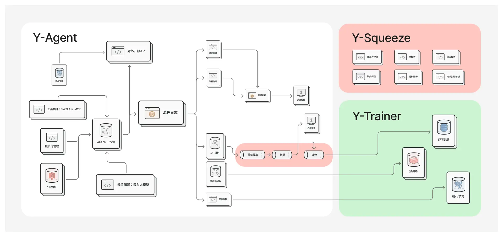

# 介绍
Y-Agent Studio 框架 完整开源，可商用，不区分社区版 商用版，下载后意味着您可以获得全部功能。

既保持了写代码一样的灵活性，又有便捷的可视化界面，可以进行流程编排迭代、自动化测试、语料标注与生产。

能解决：

- 复杂的流程编排，支持嵌套，有环的循环连接
- 完善的日志系统，可以可视化展示、自动化分析
- 系统集成能力开放，与现有IT系统无缝集成
- 自动化测试、语料标注、语料生产与管理
- 垂直领域训练总是破坏模型能力的问题

## 系统架构图

## Y-Trainer 介绍 （计划10月开源）

Y-Trainer 是一个旨在增强Y-Agent基础模型能力的大模型训练框架，该框架包含继续预训练(CPT)、指令微调(SFT)、强化学习(RL)三个部分：

> 计划：10月开源

### CPT：继续预训练

支持切块与非切块的模型预训练方法，可高效利用训练数据提升模型在指定领域的能力。

### SFT：指令微调
不同于传统SFT，我们使用自研训练方法，达到如下效果

1. 限制了语料中错误知识的影响，尽量保留了基础模型的能力。

2. 自动识别语料难度按从易到难训练模型，提高了模型的学习效果。

3. 无需做数据集平衡，快速收敛。同时几乎不会破坏模型原有能力。

### RL：强化学习
全新的强化学习框架，基于SFT，有以下优点：

资源需求少：不需要参考模型、奖励模型、价值网络model等，只需要合理编写奖励函数，即可完成训练。

训练稳定：通过高熵token作为分支节点，自动产生语料树，再使用内置的聚类算法，进行剪枝，保证探索充分。结合自适应梯度计算，训练过程稳定可靠。

## 相关资料：

[Y-Agent Studio官方介绍](http://112.126.109.80/docs)

[Y-Agent 使用说明](http://112.126.109.80/docs/y-agent/quick_start)

[Y-Squeeze 使用说明](http://112.126.109.80/docs/y-squeeze/introduction)

[Y-Trainer 介绍](http://112.126.109.80/docs/y-trainer/introduction)

[Y-Agent Studio官网](http://112.126.109.80)
